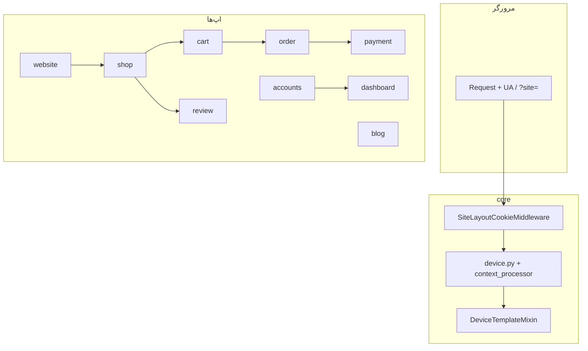

# رودمپ یادگیری + ریفکتور — shop-Arvin

پروژه یک **فروشگاه Django 4.2** با PostgreSQL است: صفحات عمومی، فروشگاه، سبد، سفارش، پرداخت (زرین‌پال + کارت‌به‌کارت)، داشبورد ادمین/مشتری، بلاگ و PWA.

معماری اصلی که باید زود بفهمی:

- **دو لایه موبایل/دسکتاپ** (حدود ۸۰ تمپلیت جدا)
- **سبد session + مدل DB**

---

## نقشه ذهنی (یک نگاه)



### اپ‌ها و نقش هر کدام

| اپ | نقش | فایل‌های کلیدی |
|---|---|---|
| `core` | تنظیمات، URL ریشه، device، mixin | `settings.py`, `urls.py`, `device.py`, `mixins.py` |
| `accounts` | کاربر سفارشی + پروفایل | `models.py`, `views.py` |
| `shop` | محصول، دسته، wishlist | `models.py`, `views.py` |
| `cart` | سبد session + مدل | `cart.py`, `views.py` |
| `order` | آدرس، کوپن، سفارش | `models.py`, `views.py` |
| `payment` | پرداخت، تنظیمات | `zarinpal_client.py`, `models.py` |
| `dashboard` | CRUD ادمین/مشتری | `admin/views/*`, `customer/views/*` |
| `website` | صفحه اصلی، FAQ، بنر، PWA | `models.py`, `pwa_views.py` |
| `blog` | پست و دسته | `models.py`, `views.py` |
| `review` | نظر محصول | `models.py`, `forms.py` |

### مدل‌های مهم (خلاصه)

| مدل | اپ | نکته |
|---|---|---|
| `User`, `Profile` | accounts | `UserType` ادمین/مشتری |
| `ProductModel`, `ProductCategoryModel` | shop | قیمت، وضعیت publish |
| `CartModel`, `CartItemModel` | cart | در کنار `CartSession` در session |
| `OrderModel`, `CouponModel`, `UserAddressModel` | order | وضعیت سفارش، tracking |
| `PaymentModel` | payment | زرین‌پال + card-to-card |
| `HomeBanner` | website | `display_target` برای فیلتر device |
| `Post`, `Category` | blog | محتوا + تصاویر |
| `ReviewModel` | review | وضعیت تأیید |

### وابستگی مدل‌ها (ترتیب مطالعه)

```
accounts.User → shop.Product → cart → order → payment → review → blog → website
```

---

## اصول کار با هم (استپ‌به‌استپ)

هر فاز این الگو را دارد:

1. **یاد بگیر** — یک جریان end-to-end را trace می‌کنیم (URL → view → model → template).
2. **یادداشت کوتاه** — ۳–۵ جمله «این بخش چه می‌کند» (اختیاری).
3. **ریفکتور کوچک** — یک تغییر محدود با تست دستی مشخص؛ commit فقط وقتی بخواهی.
4. **چک‌لیست** — قبل رفتن فاز بعد، موارد آن فاز تیک می‌خورند.

**قانون طلایی:** یک PR ذهنی = یک فاز. ریفکتورهای بزرگ (مثل ادغام تمپلیت‌ها) عمداً به فاز ۷–۸ می‌روند.

---

## فاز ۰ — آماده‌سازی (نیم‌روز)

**هدف:** پروژه را بالا بیاوری و مسیر درخواست را ببینی.

| کار | یادگیری | ریفکتور (اختیاری) |
|---|---|---|
| `docker-compose up` یا `manage.py runserver` | env با `python-decouple` | — |
| باز کردن `/`, `/shop/`, `/cart/`, `/dashboard/` | جریان URL در `core/urls.py` | `SECRET_KEY` فقط در `.env` (بدون commit سکرت) |
| debug toolbar در dev | static/media در DEBUG | — |

**خروجی فاز:** یک تصویر ذهنی از «کدام URL به کدام اپ می‌رود».

**چک‌لیست:**

- [ ] سرور بالا می‌آید
- [ ] صفحه اصلی، shop، cart، dashboard باز می‌شوند
- [ ] `core/urls.py` را یک بار خوانده‌ام

---

## فاز ۱ — هسته Django (`core`) — ~۱ روز

**فایل‌ها:**

- `core/core/settings.py`
- `core/core/middleware.py`
- `core/core/device.py`
- `core/core/device_templates.py`
- `core/core/mixins.py`
- `core/core/context_processors/device.py`

**یاد بگیر:**

- `UserAgentMiddleware` + `is_mobile_site()` (موبایل واقعی، نه تبلت)
- `?site=mobile|desktop` + کوکی `site_layout`
- `DeviceTemplateMixin` → `resolve_device_template()` → `*-mobile.html`

**trace پیشنهادی:**

1. `core/urls.py` → یک URL مثل صفحه اصلی
2. `website/views.py` → mixin تمپلیت
3. `device.py` + `middleware.py`
4. `index.html` vs `index-mobile.html`

**ریفکتور پیشنهادی:**

- [ ] تست واحد برای `is_mobile_site` و `filter_queryset_for_device`
- [ ] توضیح کوتاه ترتیب middleware در settings (چرا بعد از sessions)

**چک‌لیست:**

- [ ] با `?site=mobile` تمپلیت موبایل می‌آید
- [ ] با `?site=desktop` تمپلیت دسکتاپ می‌آید
- [ ] بدون query، UA موبایل/دسکتاپ درست تشخیص داده می‌شود

---

## فاز ۲ — مدل‌ها و دیتابیس — ~۲ روز

**یاد بگیر:** هر `models.py` را به ترتیب وابستگی بالا بخوان؛ `python manage.py shell` برای آزمایش.

**ریفکتور پیشنهادی:**

- [ ] `related_name` و `Meta.ordering` یکدست
- [ ] متدهای تکراری قیمت/جمع روی `OrderModel` متمرکز (اگر پراکنده‌اند)
- [ ] migration فقط با تغییر واقعی schema

**چک‌لیست:**

- [ ] در shell یک سفارش نمونه از User تا Payment را دستی trace کردم
- [ ] `HomeBanner.display_target` و `filter_queryset_for_device` را فهمیدم

---

## فاز ۳ — احراز هویت (`accounts`) — ~۱ روز

**trace:** register/login → session → دسترسی dashboard

**یاد بگیر:** `AbstractBaseUser`, validators, forms

**ریفکتور پیشنهادی:**

- [ ] `LoginRequiredMixin` / permission checks یکسان در dashboard
- [ ] تست: مشتری به admin dashboard نرود

**چک‌لیست:**

- [ ] ثبت‌نام و لاگین کار می‌کند
- [ ] نوع کاربر (`UserType`) را در کد پیدا کردم

---

## فاز ۴ — فروشگاه و سبد (`shop` + `cart`) — ~۲ روز

**trace مهم:**

1. لیست محصول (`shop/views`)
2. `CartSession.add_product` → `get_cart_items`
3. sync با `CartModel` برای کاربر لاگین‌شده

**نکته:** `get_cart_items` ممکن است N+1 روی `ProductModel.objects.get` داشته باشد.

**ریفکتور پیشنهادی:**

- [ ] `select_related` / `prefetch_related` در لیست محصول و سبد
- [ ] لایه service برای سبد (مثلاً `cart/services.py`) بدون تغییر رفتار

**چک‌لیست:**

- [ ] افزودن / تغییر تعداد / حذف محصول در سبد
- [ ] موبایل و دسکتاپ هر دو درست

---

## فاز ۵ — سفارش و پرداخت (`order` + `payment`) — ~۲–۳ روز

**trace:** checkout → `OrderModel` → redirect زرین‌پال → callback → completed/failed

**یاد بگیر:**

- `payment/zarinpal_client.py`
- `PaymentStatusType`, card-to-card + receipt

**ریفکتور پیشنهادی:**

- [ ] idempotency در callback پرداخت
- [ ] logging برای خطای پرداخت
- [ ] تست integration با mock زرین‌پال

**چک‌لیست:**

- [ ] مسیر checkout را end-to-end فهمیدم
- [ ] مسیر card-to-card را جدا trace کردم

---

## فاز ۶ — داشبورد (`dashboard`) — ~۳–۴ روز

**ساختار:**

- `dashboard/admin/views/*` + forms + urls
- `dashboard/customer/views/*`
- `DashboardDeviceTemplateMixin` (= `DeviceTemplateMixin`)

**ترتیب پیشنهادی داخل dashboard:**

1. categories → products
2. orders → payment settings
3. users → coupons
4. blog → faq → banners

**ریفکتور (تدریجی — یک resource در هر استپ):**

- [ ] `BaseAdminView` با permission و pagination مشترک
- [ ] فرم‌های تکراری فقط وقتی duplication واضح است

**چک‌لیست:**

- [ ] یک CRUD ادمین (مثلاً محصول) را کامل trace کردم
- [ ] یک صفحه مشتری (مثلاً سفارش‌ها) را trace کردم

---

## فاز ۷ — لایه نمایش (تمپلیت‌ها) — موازی، ۱–۲ هفته

**واقعیت:** ~۸۰ فایل `*-mobile.html` — یادگیری خوب، نگهداری سخت.

**استراتژی ریفکتور:**

| سطح | کار | ریسک |
|---|---|---|
| ۱ | `includes/` مشترک (header/footer/nav) | کم |
| ۲ | `` فقط جایی که تفاوت کم است | متوسط |
| ۳ | ادغام کامل mobile/desktop | بالا — آخر |

**فعلاً نگه دار:** `DeviceTemplateMixin` تا تمپلیت‌ها ادغام نشده‌اند.

**چک‌لیست:**

- [ ] `base.html` / `base-mobile.html` را خواندم
- [ ] یک جفت desktop/mobile را کنار هم مقایسه کردم

---

## فاز ۸ — کیفیت، امنیت، deploy — مداوم

| موضوع | وضع فعلی | اقدام |
|---|---|---|
| تست | تقریباً خالی | pytest-django از فاز ۱ |
| `DEBUG`, `ALLOWED_HOSTS` | از env | چک production |
| Static/Media | DEBUG vs prod | `collectstatic` در prod |
| PWA | `sw.js`, manifest | cache strategy |

**چک‌لیست:**

- [ ] `docker-compose.prod.yml` را یک بار خواندم
- [ ] requirements و نسخه Django را می‌دانم (`Django>4.2,<4.3`)

---

## برنامه هفته‌به‌هفته

| هفته | فاز | تمرکز ریفکتور |
|---|---|---|
| ۱ | ۰ + ۱ + شروع ۲ | تست device + settings |
| ۲ | ۲ + ۳ | مدل‌ها + auth permissions |
| ۳ | ۴ | cart N+1 + service layer |
| ۴ | ۵ | payment idempotency |
| ۵–۶ | ۶ | dashboard — یک resource در روز |
| ۷+ | ۷ + ۸ | تمپلیت + تست CI |

---

## قدم بعدی

برای شروع عملی با هم:

**فاز ۱** — trace صفحه اصلی + تست‌های `is_mobile_site`

در چت بنویس: **«برو فاز ۱»**

یا اولویت دیگر بگو (مثلاً فقط payment یا فقط dashboard) تا ترتیب فازها عوض شود.

---

## یادداشت پیشرفت (خودت پر کن)

| فاز | تاریخ شروع | تاریخ پایان | یادداشت |
|---|---|---|---|
| ۰ | | | |
| ۱ | | | |
| ۲ | | | |
| ۳ | | | |
| ۴ | | | |
| ۵ | | | |
| ۶ | | | |
| ۷ | | | |
| ۸ | | | |
